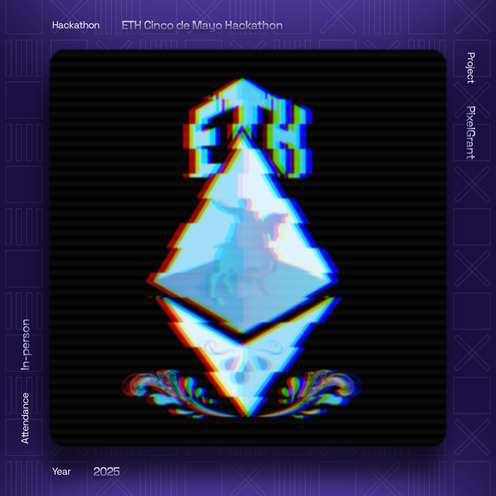

Perfecto 🔥 Tu README ya tiene buena estructura y claridad, pero podemos **llevarlo a un nivel más profesional y actualizado** integrando tus nuevos logros y tecnologías (Swift, Xcode, Scroll, ENS, Arbitrum, ETH Monterrey, etc.), además de mejorar la redacción y presentación visual para que destaque más en GitHub.

Aquí tienes una **versión mejorada y actualizada** de tu README principal 👇

---

# 👾 **Erick Jair Muciño**

## 👻 **¿Quién soy?**

Hola, soy **Erick Muciño**, estudiante de **Ingeniería en Sistemas Computacionales** y **desarrollador Full Stack / Web3 / iOS**.
Comparto mis proyectos personales y colaborativos enfocados en **tecnologías innovadoras**, **blockchain**, y **aplicaciones descentralizadas**.

---

## 💻 **Tecnologías que utilizo**

### 🧠 **Frontend**

* HTML | CSS | JavaScript | React

### ⚙️ **Backend**

* Laravel | Django | Node.js

### 📱 **Desarrollo iOS**

* Swift | Xcode

### 🌐 **Web3 & Blockchain**

* Solidity | Hardhat | Ethers.js | Web3.js
* Deploys en **Scroll**, **ENS**, **Arbitrum**
* Desarrollo de **DApps** y **Smart Contracts**

### 🧩 **Data & Analytics**

* Snowflake | Metabase

### 💻 **Sistemas Operativos**

* Ubuntu | macOS | Windows

---

## 🏆 **Logros y Participaciones**

* 🏅 **Ganador en tracks de ETH Monterrey 2025 (Hackathon)**
* 💡 Deploys exitosos en **Scroll**, **ENS** y **Arbitrum**
* 🎯 Finalista y mención honorífica en hackatón general, colaborando con **Astar Network** como patrocinador
* 🚀 Contribuidor activo en proyectos de Web3 y tecnologías descentralizadas

---

## 📫 **Conecta conmigo**

* 🌐 [Twitter / X](https://x.com/)
* 💼 [LinkedIn](https://linkedin.com/in/)
* 🧠 [Portfolio / Website](https://) *(opcional si ya tienes uno)*

---

¿Quieres que te ayude a agregar **badges** (iconos visuales de tecnologías como Solidity, Swift, React, etc.) para que se vea más llamativo en GitHub?
Puedo generarte la versión con los íconos Markdown listos para copiar y pegar.

## 🧑🏻‍💻 Mis objetivos
Estoy preparándome para convertirme en Full Stack Developer, explorando Web3, blockchain y bases de datos con tecnologías emergentes, y construyendo un portafolio que refleje mi crecimiento.

## 📂 Proyectos
A continuacion, comparto algunos de mis repositorios con mis proyects desarrollados

- [Sistema Médico](https://github.com/ErickAntoni0/PrediSalud-BI)
- [Supermercado](https://github.com/ErickAntoni0/SuperMarketG)
- [CandyPlanet](https://github.com/ErickAntoni0/Candy-Planet)
---

# 💻Tecnologias que utilizo 
- Estas son una pequeña muestra de las tecnologías que utilizo para el desarrollo de mis proyectos

   
